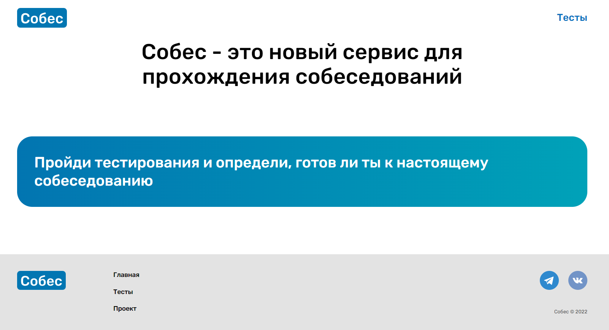
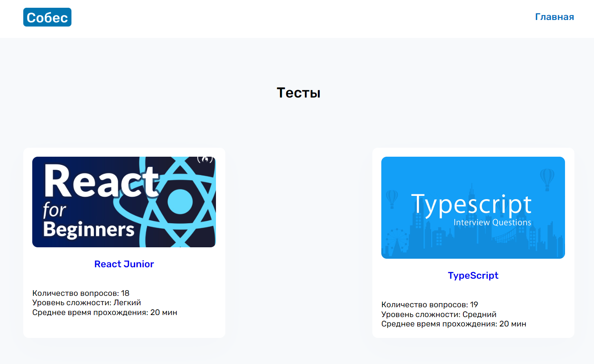
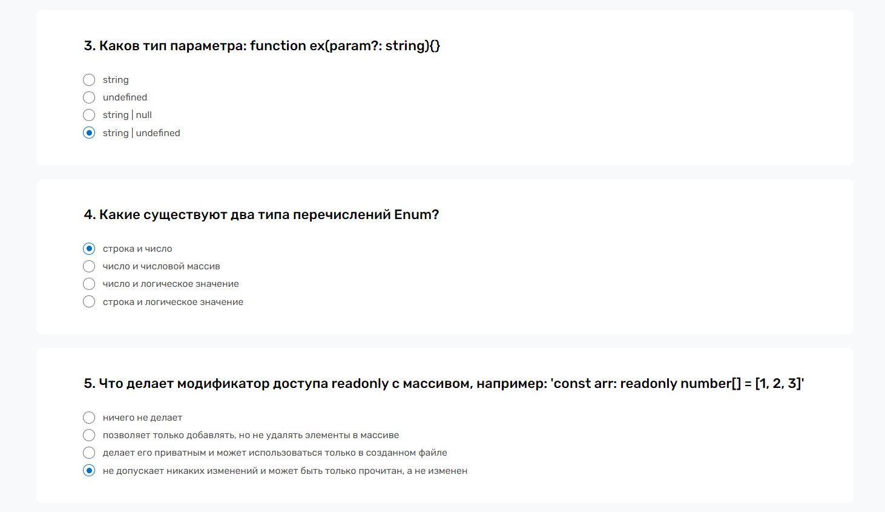
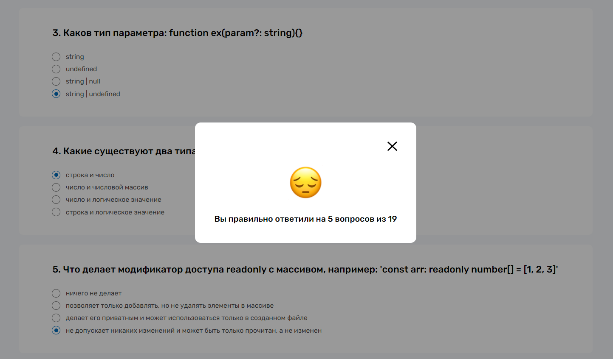

# Курсовая работа: веб-приложение "Собес"

http://sobes.std-1830.ist.mospolytech.ru/ - ссылка на проект
## Используемые технологии
Python, Django, Django Rest Framework, React, TypeScript, Redux Toolkit, SASS, Webpack

## Описание проекта
* Собес - это сервис, где вы можете проверить свои знания по интересующим вас технологиям
* Главная страница

* Страница с тестами, где вы можете выбрать любой тест, сейчас там есть 2 теста: React и TypeScript

* Сама страница с тестом состоит из карточек с вопросом и одним вариантом ответа

* После нажатия на кнопку "Узнать результат" всплывает модальное окно с вашим результатом

* API для проекта написано на фреймворке Django и Django Rest Framework